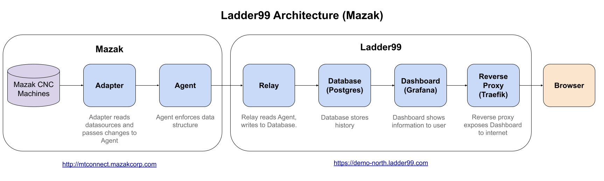

# Client setup for Mazak demo

Mazak has a set of CNC machines connected to MTConnect Agents here http://mtconnect.mazakcorp.com/.

This setup uses a Digital Ocean droplet to host the Ladder99 pipeline (Relay, Postgres, Grafana), and a reverse proxy (Traefik).

The idea is that the Traefik container will be the only one with port 80 and 443 exposed on an external Docker network.

## Diagram

https://docs.google.com/drawings/d/1bBneF6XSqm4Qls_OiLGLMFbBTbfJwSQ-BV3SmlJ-H90/edit?usp=sharing

## Links

Grafana
https://demo-north.ladder99.com

Traefik monitor
https://demo-north-monitor.ladder99.com

## Setup

Login to the Droplet console here -
https://cloud.digitalocean.com/droplets/285467341/access

Login as root then drop down to user with `su - user`.

Make a directory ladder99

    mkdir ladder99
    cd ladder99

Clone this repo and ladder99-ce there

    git clone https://github.com/Ladder99/ladder99-ce
    git clone https://github.com/Ladder99/client-mazak
    cd ladder99-ce

Create a Docker network

    docker network create web

Start all Docker services (Relay, Postgres, Grafana, Traefik) -

    ./start mazak all

then you can visit the Traefik monitor at
https://demo-north-monitor.ladder99.com/dashboard/

and Grafana on
https://demo-north.ladder99.com/dashboard/

This setup is based on
https://www.digitalocean.com/community/tutorials/how-to-use-traefik-v2-as-a-reverse-proxy-for-docker-containers-on-ubuntu-20-04
